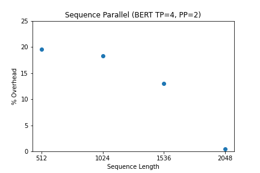

# Megatron-LM-Benchmarks

This repository is a collection of benchmarks of NVIDIA's Megatron-LM. The baseline model is just model parallelism, no recomputation or sequence parallelism. We compare against the baseline model when marking overheads. All timing calculations are based on the time to perform 100 training iterations.

We use one cluster of 8 V100 GPUs through AWS for all benchmarking. If sequence paralleism is enabled, the partitions are sent to the same GPUs as the tensor parallelism. The recorded peak memory is the peak memory allocated across any of the GPUs during training. For example, if GPU 1 had a peak allocation of 100 MB, and GPU 2 had a peak allocation of 200 MB, the recorded peak allocation of the system would be 200 MB.

# Graphs

## BERT 345M (2-way Tensor Parallelism, 2-way Pipeline Parallelism)

## BERT 345M (4-way Tensor Parallelism, 2-way Pipeline Parallelism)

## GPT-2 345M (4-way Tensor Parallelism, 2-way Pipeline Parallelism)

## GPT-2 345M (8-way Tensor Parallelism, 1-way Pipeline Parallelism)

# Raw Data

## BERT 345M (2-way Tensor Parallelism, 2-way Pipeline Parallelism)

### 512 Sequence Length

| Strategy                                | Time (ms) | Peak Memory (MB) |
| --------------------------------------- | --------- | ---------------- |
| Baseline                                | 327       | 2487             |
| Sequence Parallel                       | 388       | 2359             |
| Selective Recompute                     | 378       | 2011             |
| Sequence Parallel + Selective Recompute | 437       | 1868             |
| Full Recompute                          | 448       | 1801             |

### 1024 Sequence Length

| Strategy                                | Time (ms) | Peak Memory (MB) |
| --------------------------------------- | --------- | ---------------- |
| Baseline                                | 330       | 4491             |
| Sequence Parallel                       | 398       | 4245             |
| Selective Recompute                     | 382       | 2607             |
| Sequence Parallel + Selective Recompute | 449       | 2366             |
| Full Recompute                          | 450       | 1840             |

### 1536 Sequence Length

| Strategy                                | Time (ms) | Peak Memory (MB) |
| --------------------------------------- | --------- | ---------------- |
| Baseline                                | 399       | 7532             |
| Sequence Parallel                       | 427       | 7151             |
| Selective Recompute                     | 471       | 3331             |
| Sequence Parallel + Selective Recompute | 489       | 2969             |
| Full Recompute                          | 546       | 2073             |

### 2048 Sequence Length

| Strategy                                | Time (ms) | Peak Memory (MB) |
| --------------------------------------- | --------- | ---------------- |
| Baseline                                | 567       | 11490            |
| Sequence Parallel                       | 587       | 10999            |
| Selective Recompute                     | 655       | 4110             |
| Sequence Parallel + Selective Recompute | 676       | 3629             |
| Full Recompute                          | 765       | 2318             |

## BERT 345M (4-way Tensor Parallelism, 2-way Pipeline Parallelism)

### 512 Sequence Length

| Strategy                                | Time (ms) | Peak Memory (MB) |
| --------------------------------------- | --------- | ---------------- |
| Baseline                                | 537       | 1376             |
| Sequence Parallel                       | 642       | 1193             |
| Selective Recompute                     | 635       | 1139             |
| Sequence Parallel + Selective Recompute | 735       | 954              |
| Full Recompute                          | 785       | 936              |

### 1024 Sequence Length

| Strategy                                | Time (ms) | Peak Memory (MB) |
| --------------------------------------- | --------- | ---------------- |
| Baseline                                | 546       | 2545             |
| Sequence Parallel                       | 646       | 2161             |
| Selective Recompute                     | 633       | 1587             |
| Sequence Parallel + Selective Recompute | 734       | 1225             |
| Full Recompute                          | 760       | 985              |

### 1536 Sequence Length

| Strategy                                | Time (ms) | Peak Memory (MB) |
| --------------------------------------- | --------- | ---------------- |
| Baseline                                | 584       | 4152             |
| Sequence Parallel                       | 660       | 3608             |
| Selective Recompute                     | 660       | 2044             |
| Sequence Parallel + Selective Recompute | 749       | 1505             |
| Full Recompute                          | 783       | 1118             |

### 2048 Sequence Length

| Strategy                                | Time (ms) | Peak Memory (MB) |
| --------------------------------------- | --------- | ---------------- |
| Baseline                                | 743       | 6267             |
| Sequence Parallel                       | 747       | 5529             |
| Selective Recompute                     | 758       | 2567             |
| Sequence Parallel + Selective Recompute | 782       | 1846             |
| Full Recompute                          | 805       | 1302             |

## GPT-2 345M (4-way Tensor Parallelism, 2-way Pipeline Parallelism)

### 512 Sequence Length

| Strategy                                | Time (ms) | Peak Memory (MB) |
| --------------------------------------- | --------- | ---------------- |
| Baseline                                | 288       | 2113             |
| Sequence Parallel                       | 340       | 1740             |
| Selective Recompute                     | 336       | 1631             |
| Sequence Parallel + Selective Recompute | 392       | 1258             |
| Full Recompute                          | 412       | 1107             |

### 1024 Sequence Length

| Strategy                                | Time (ms) | Peak Memory (MB) |
| --------------------------------------- | --------- | ---------------- |
| Baseline                                | 293       | 4368             |
| Sequence Parallel                       | 343       | 3631             |
| Selective Recompute                     | 342       | 2467             |
| Sequence Parallel + Selective Recompute | 398       | 1747             |
| Full Recompute                          | 415       | 1437             |

### 1536 Sequence Length

| Strategy                                | Time (ms) | Peak Memory (MB) |
| --------------------------------------- | --------- | ---------------- |
| Baseline                                | 386       | 7619             |
| Sequence Parallel                       | 389       | 6525             |
| Selective Recompute                     | 440       | 3421             |
| Sequence Parallel + Selective Recompute | 436       | 2346             |
| Full Recompute                          | 522       | 1791             |

### 2048 Sequence Length

| Strategy                                | Time (ms) | Peak Memory (MB) |
| --------------------------------------- | --------- | ---------------- |
| Baseline                                | 527       | 11862            |
| Sequence Parallel                       | 520       | 10382            |
| Selective Recompute                     | 612       | 4450             |
| Sequence Parallel + Selective Recompute | 604       | 3005             |
| Full Recompute                          | 721       | 2161             |

## GPT-2 345M (8-way Tensor Parallelism, 1-way Pipeline Parallelism)

### 512 Sequence Length

| Strategy                                | Time (ms) | Peak Memory (MB) |
| --------------------------------------- | --------- | ---------------- |
| Baseline                                | 456       | 1711             |
| Sequence Parallel                       | 558       | 1280             |
| Selective Recompute                     | 549       | 1473             |
| Sequence Parallel + Selective Recompute | 635       | 1042             |
| Full Recompute                          | 645       | 933              |

### 1024 Sequence Length

| Strategy                                | Time (ms) | Peak Memory (MB) |
| --------------------------------------- | --------- | ---------------- |
| Baseline                                | 468       | 3230             |
| Sequence Parallel                       | 550       | 2367             |
| Selective Recompute                     | 557       | 2270             |
| Sequence Parallel + Selective Recompute | 644       | 1406             |
| Full Recompute                          | 663       | 1186             |

### 1536 Sequence Length

| Strategy                                | Time (ms) | Peak Memory (MB) |
| --------------------------------------- | --------- | ---------------- |
| Baseline                                | 469       | 5204             |
| Sequence Parallel                       | 557       | 3908             |
| Selective Recompute                     | 559       | 3034             |
| Sequence Parallel + Selective Recompute | 637       | 1745             |
| Full Recompute                          | 661       | 1446             |

### 2048 Sequence Length

| Strategy                                | Time (ms) | Peak Memory (MB) |
| --------------------------------------- | --------- | ---------------- |
| Baseline                                | 523       | 7669             |
| Sequence Parallel                       | 558       | 5949             |
| Selective Recompute                     | 586       | 3829             |
| Sequence Parallel + Selective Recompute | 646       | 2109             |
| Full Recompute                          | 710       | 1710             |
